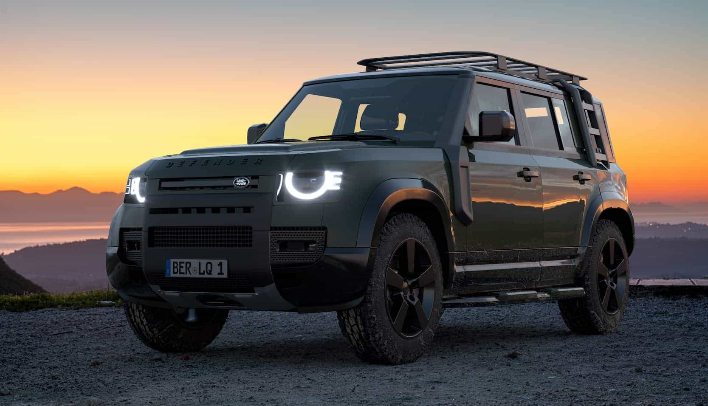

# Brochure Website Template

A single-page brochure website template built with plain HTML, CSS, and JavaScript. It ships with an interactive 3D product viewer, an animated typing headline, a responsive mobile menu, and SEO metadata including JSON-LD structured data. The demo content is a fictional luxury SUV, the APEX Vantara — swap the copy, images, and 3D model for your own product.



## Getting Started

These instructions will get you a copy of the project up and running on your local machine.

### Prerequisites

No build step and no package manager. You only need:

* A modern browser with WebGL support (Chrome, Safari, Firefox, Edge)
* Any static web server — the 3D model is loaded over `fetch`, so opening `index.html` as a `file://` URL will not work


### Installing

Clone the repository:

```
git clone https://github.com/jimwangdev24/brochure-website_template.git
cd brochure-website-template
```


To use it for your own product, replace:

* `index.html` — copy, headings, and the JSON-LD block at the top
* `img/` — hero photography, logo, and favicon
* `*.glb` — your own model, referenced from the `<model-viewer>` tag
* `js/script3d.js` — hotspot positions and their titles and descriptions

## Running the tests

There is no automated test suite. Verify a change by hand:

* Load the page and confirm the 3D model appears and can be orbited and zoomed
* Click each hotspot and confirm the spec dialog opens with the right text and closes again
* Resize to a narrow viewport and confirm the hamburger menu opens and the model zooms out to fit


## Built With

* [@google/model-viewer](https://github.com/google/model-viewer) 4.3.1 — the interactive 3D and AR viewer
* [ityped](https://github.com/EmailThis/ityped) 1.0.3 — the animated typing headline

Both are loaded from a CDN at runtime. Unminified copies are kept in `Plugins/` for reference; see `Plugins/SOURCES.txt` for exact versions and source URLs.

## Contributing

Pull requests are welcome. Keep changes to plain HTML, CSS, and JavaScript — the point of this template is that it has no build step.

## Versioning

No formal versioning. Use the git history for the record of changes.

## Authors

* **Jim Wang** — *Initial work*

## License

This project is licensed under the MIT License — see the [LICENSE](LICENSE) file for details. Third-party libraries, the 3D model, and the photography keep their own licenses.

## Acknowledgments

* 3D model: *2021 Land Rover Defender 110*
* HDR environment map: `studio_kominka_02_2k` from [Poly Haven](https://polyhaven.com) (CC0)

